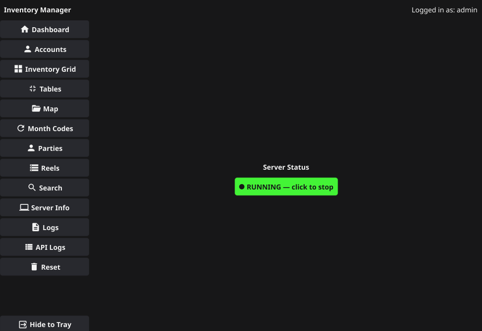
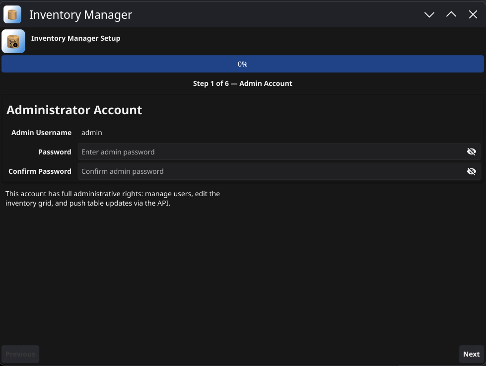
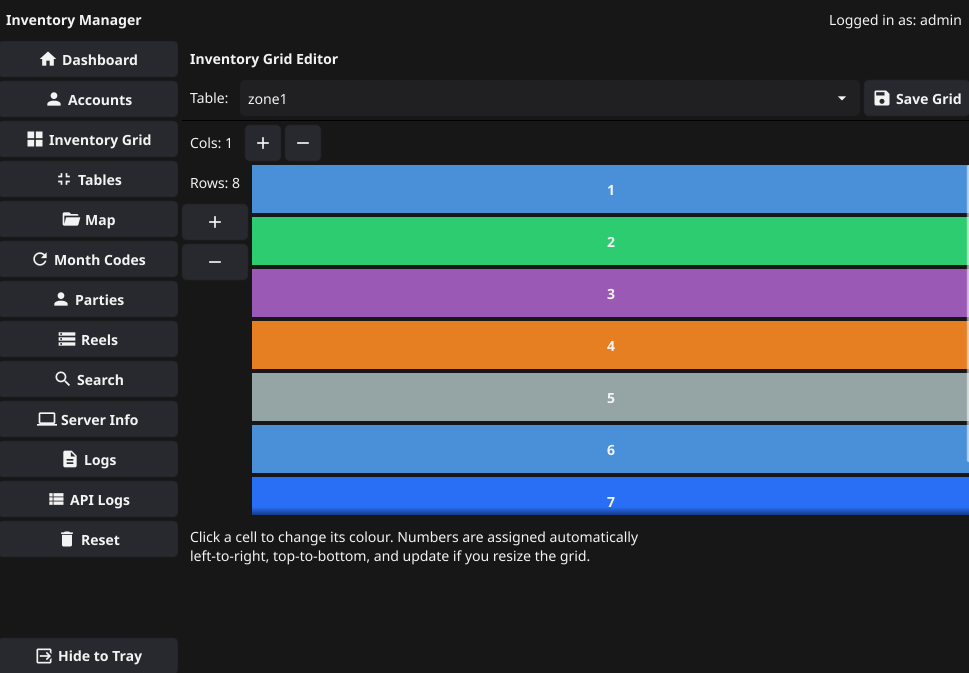
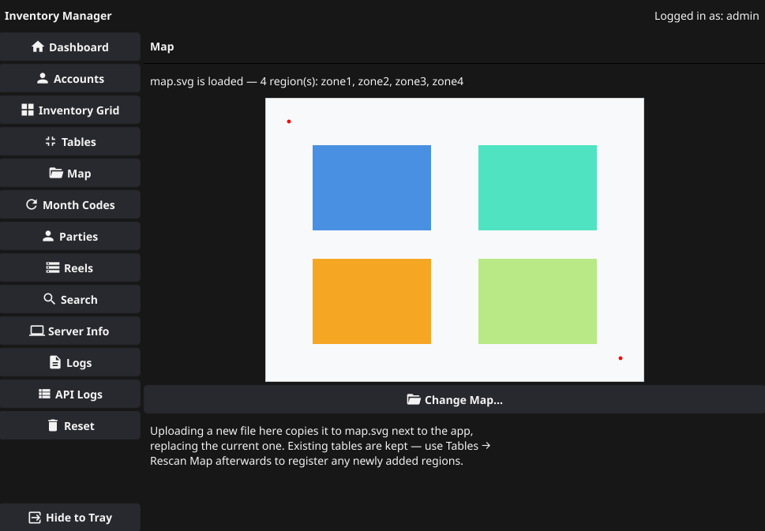
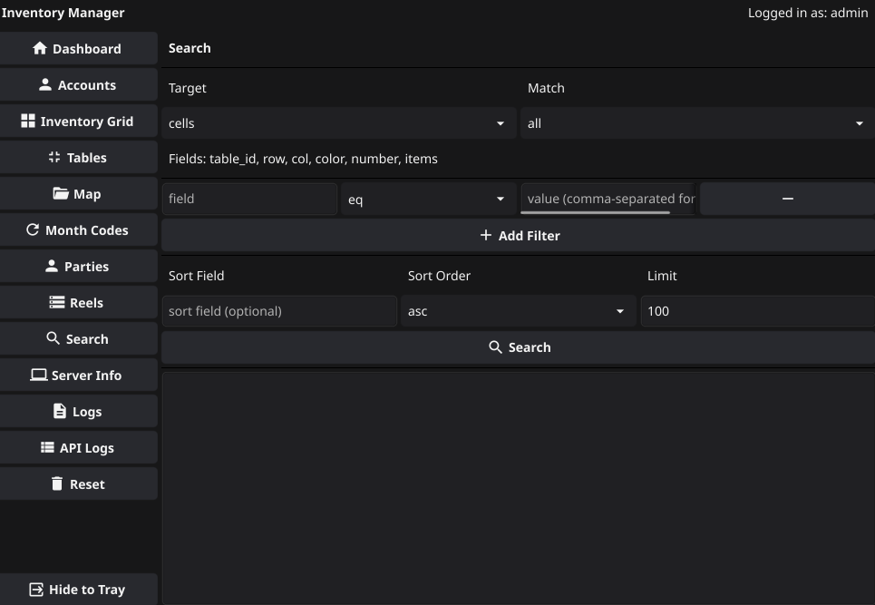
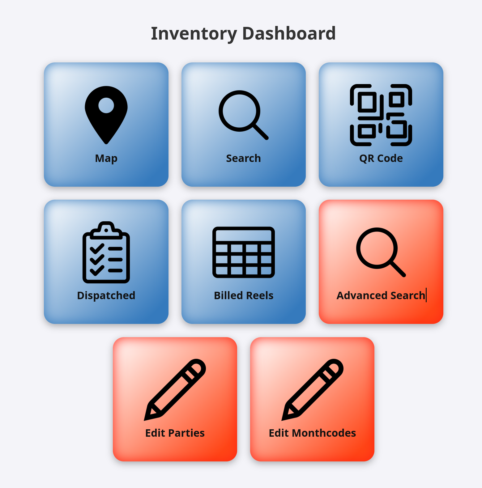
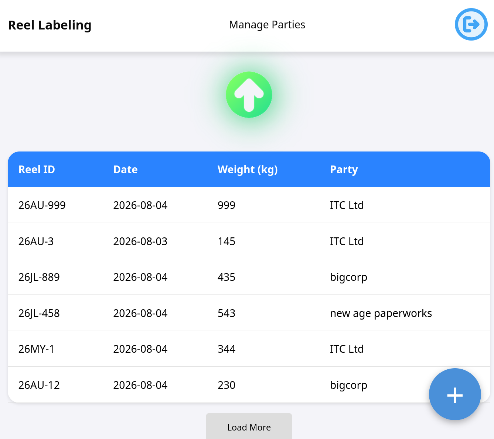
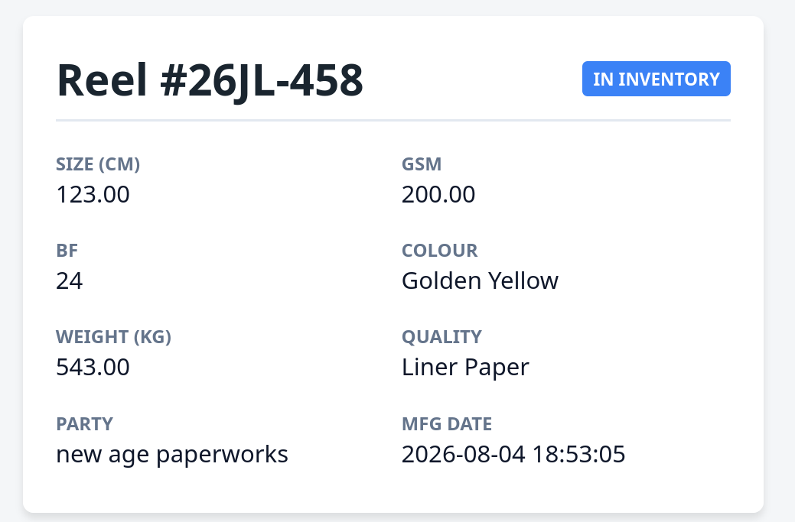

# Inventory Management App
This is an inventory management APP written in Go, Api using fiber and sqLite db with fyne server GUI
It compliments the server side functionality of my another app
[complementary app](https://github.com/AnubhavSingh0708/Invenotry-Mobile)

# features
## exceptional performance using go fiber
best in class response time

## Easy setup GUI
The GUI makes it easy to set up everything on this app, accounts , tables and map. and expose ports , use certmagic to get certificates

## detailed menus
Server Gui offer menus that would fit your every need.

## Robust detailed API
Contains a lot of detailed API that suit your demands.
## standardised maps
upload your own maps using SVG

## Optimised SQlite
For the best performance
## SSE
server side events for instant refreshes
## Advanced search API

## Included HTML pages like 
### dashboard

### reel management UI
./public/reelmanager

### printing lables utility

### QR code lookup

# known issues
## Auth safety
Currently passes keys in URI queries that may be subjected to man in the middle attacks
### planned fix
Next rollout will include Auth middleware, letting go queries for auth headers

# documentation
[docs](./docs/index.md)

### credits
Icons sourced from flaticon
